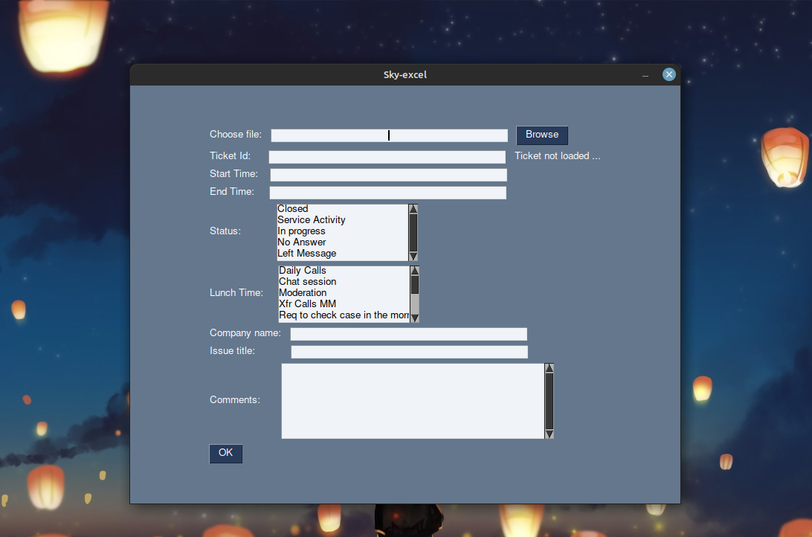

# Sky-excel

A simple python GUI application that I made for adding information in excel sheets and help making reports for my Dad's work

- Added the option to track no. of tickets done
- Makes a report for each ticket as .txt file
- Adds all the entered information in an excel sheet
